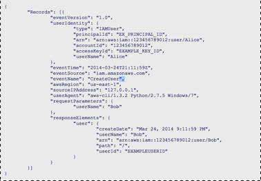

# Performing a Basic Audit of your AWS Environment

## Overview

This lab leads you through the steps to perform basic audits of core AWS
resources. You will use the AWS Management Console to understand how
to audit the use of multiple AWS services, Amazon EC2, Amazon VPC,
Amazon IAM, Amazon Security Groups, AWS CloudTrail and Amazon
CloudWatch. This lab will help you understand how you can extend your
existing auditing objectives related to organizational Governance, Asset
Configuration, Logical Access Controls, Operating Systems, Databases
and Applications security configurations within AWS. The skills learned
will help provide visibility; testability and automated audit evidence gather
capabilities.

### Topics Covered

By the end of this lab, you will be able to:

* Review user permissions in AWS IAM.
* Capture audit evidence using AWS IAM Policy Simulator.
* Review Inbound and Outbound networking rules for Amazon EC2
* Security Groups.
* Review Amazon VPC configurations, subnets, and Network ACLs.
* Review Amazon CloudWatch performance metrics.
* Review raw Amazon CloudTrail logs within Amazon S3.

### Technical Knowledge Required

To successfully complete this lab, you should be familiar with basic AWS
services.

### Environment Setup

Launch the CloudFormation stack by clicking on **Deploy to AWS** below.

You will be prompted to input some parameters. Fill them in accordingly and proceed to create the
stack. Once the stack creation is in progress, you can view the resources created by the stack by
clicking the **Resources** tab in the bottom pane.

Wait till the stack creation is complete (**CREATE_COMPLETE**) before proceeding with the next steps.

## Auditing User Permissions in IAM

AWS Identity and Access Management (IAM) enables you to securely
control access to AWS services and resources for your users. Using IAM,
you can create and manage AWS users and groups and use permissions
to allow and deny their access to AWS resources.
In this lab, we will launch IAM secure AWS Access Control in order to
review permissions, group assignments and roles associated with the
auditing instance:

### Review User Permissions

1. From the AWS Management Console, click Services. Then under Security & Identity, click Identity
& Access Management.
2. In the left pane, click Users. There should be a user that starts with **lab-...**. 
3. Click on the user that starts with **lab-...** to review his permissions.
4. As you review the information about this user, you should ask yourself questions such as:
  * What groups is the user associated with? Are they appropriate; do they make sense?
  * What permissions apply to this user? Are they appropriate for this user?
  * Should this person have multi-factor authentication turned on?

  Review the **Groups** section to see what groups they belong to. Groups are a collection of IAM
  users. Administrators use groups to specify permissions for a collection of users in order to
  manage those permissions easier. Some important characteristics of IAM groups:

  * A group can contain many users and a user can belong to multiple groups.
  * Groups canʼt be nested; they can contain only users, not other groups.
  * Thereʼs no default group that automatically includes all users in the AWS
  account. If you want to have a group like that, you need to create it and
  assign each new user to it.

  Review the **Permissions** section to see all policies that apply to this user. You can see that
  this user has inherited a ReadOnlyAccess policy by being a part of the **lab-...** group.

5. Click the arrow-drop-down to the left of the PowerUser Policy Name to view the 
exact policy details being applied.
6. Review the Security Credentials tab as well.
  * **Access Keys:** Keys can be active or inactive and only administrators have the ability to
  inactivate or delete keys. If a user with limited permissions tried to deactivate or delete an
  access key, they would receive the following message: We encountered the following errors while
  processing your request: User:arn:aws:iam::xxxxxxxxxxxx:user/_username_ is not authorized to
  perform: iam:UpdateAccessKey on resource: user _username_
  * **Signing Certificates:** Can be signed certificates, X.509 Certificate and/or third party tools
  (e.g. OpenSSL).
  * **Console password:** Users who use the AWS Management Console require a password. Passwords can
  be generated and/or changed by administrators within the IAM dashboard. Passwords can be
  autogenerated or custom-generated based on organization preferences.
  * **Assigned MFA (Multi-Factor Authentication) Device:** Multi-Factor Authentication is a simple
  best practice that adds an extra layer of protection on top of your username and password.
  * **Virtual:** Use your existing smartphone, tablet, or computer running any application that
  supports the open TOTP standard.
  * **Hardware Keyfob:** Tamper-evident hardware keyfob device provided by Gemalto, a 3rd-party
  provider.
  * **Hardware Display Card:** Tamper-evident hardware display card device provided by Gemalto, a
  3rd-party provider.

### Run IAM Policy Simulator

You can use the IAM Policy Simulator to test the effects of AWS IAM policies to test your existing
IAM policies to verify that they have the intended effect and capture the Policy Simulator output to
use as support evidence in user access reviews.

1. On the Permissions tab for the user whose name starts with **lab-…**, find the policy
   ReadOnlyAccess
2. Click the triangle drop-down to the left of the policy name
3. Click Simulate Policy to open the IAM Policy Simulator.
4. In the Select Service drop-down menu, select Identity and Access Management.
5. In the Select Actions drop-down menu, select two actions, DeleteGroup and DeleteRolePolicy.
6. Click Run Simulation.
  The results should be Permission: Denied, Description: Implicitly denied (no matching statements found).
7. Exit the Policy Simulator.

### Collecting Audit Evidence

From an audit evidence standpoint you can capture the IAM settings and the IAM Policy Simulator
output to be used as support evidence in user access reviews.

## Review Security Configuration of Amazon EC2 Instances

### What is Amazon EC2?

Amazon Elastic Compute Cloud (Amazon EC2) is a web service that provides resizable compute capacity
in the cloud. It is designed to make web-scale computing easier for developers. Amazon EC2 presents a
true virtual computing environment, allowing you to use web service interfaces to launch instances
with a variety of operating systems, load them with your custom application environment, manage your
networkʼs access permissions, and run your image using as many or few systems as you desire.

### What is a Security Group?

A security group acts as a virtual firewall for your instance to control inbound and outbound
traffic. Security groups act at the instance level, not the subnet level. For each security group,
you add rules that control the inbound traffic to instances and a separate set of rules that control
the outbound traffic.

The following are basic characteristics of security groups:

* You can specify allow rules, but not deny rules.
* You can specify separate rules for inbound and outbound traffic.
* By default, no inbound traffic is allowed until you add inbound rules to the security group.
* By default, all outbound traffic is allowed until you add outbound rules to the group (and then,
you specify the outbound traffic that is allowed).
* Responses to allowed inbound traffic are allowed to flow outbound regardless of outbound rules and
vice versa (security groups are therefore stateful).
* Instances associated with a security group canʼt talk to each other unless you add rules allowing
it (Exception: The default security group has these rules by default).
* After you launch an instance, you can change which security groups the instance is associated with.

### Review Running Amazon EC2 Instances

1. In the AWS Management Console, click **Services** then click **EC2**.
2. In the left pane, click **Instances**.

In this environment, there are three running instances: **Web Server**, **Bastion Host**, **SQL
Server**.

### Review Web Server Security Group

1. In the left pane of the EC2 Console, click **Security Groups** under the Network and Security
section.
2. Select the WebServer Security Group, named **WebServerSG**.
3. In the lower pane, click the **Inbound** tab.
4. Review the **Inbound Rules**.
5. Are the Inbound Rules what you would expect for the Web Server?

**Note** Within security groups you can select sources as Anywhere, Custom IP and/or MY IP; these
configuration are critical access configurations for your Amazon EC2 instances and services running
within Amazon EC2.

### Review Bastion Host Security Group

1. From the list of security groups, select the Bastion Host Security Group, named **BastionSG**.

  A Bastion host is a special purpose computer on a network specifically designed and configured to
  withstand attacks. The computer generally hosts a single application (such as a proxy server) and
  all other services are removed or limited to reduce the threat to the computer. It is hardened in
  this manner primarily due to its location and purpose, which is either on the outside of the
  firewall and usually involves access from untrusted networks or computers.

2. In the lower pane, click the **Inbound** and **Outbound** tabs to review
the Inbound and Outbound rules.

  Are the Inbound and Outbound rules what you would expect for the Bastion host?

  Notice that the Bastion host instance is specifically set up to be accessed from any IP address
  with the intent to support a protected SQL database instance, which in turn supports an externally
  facing Web Server.

### Review SQL Server Security Group

1. From the list of security groups, select the SQL Server Security Group, named **SQLSG**.
2. In the lower pane, click the **Inbound** tab. Review the Inbound Rules.

  Are the Inbound Rules what you would expect for the SQL Server?

  Notice that a custom source (in this case a security group ID from this account) has been selected.

3. Click the **Outbound** tab. Review the Outbound Rules.

  Are the Outbound Rules what you would expect for the SQL Server?

### Collecting Audit Evidence

From an audit evidence standpoint this can support your resource access isolation and data protection
from internal/external threats since internally, all access is restricted via a jump box (Bastion
Host) no one internally has direct access to this instance. Externally, the SQL Server only
communicates with the web service across via the **Web Server** and **SQL Server** security groups.

## Review Amazon VPC Security Configuration

## What is Amazon VPC?

Amazon Virtual Private Cloud (Amazon VPC) enables you to launch AWS resources into a virtual network
that you have defined. This virtual network closely resembles a traditional network that you would
operate in your own data center, with the benefits of using the scalable infrastructure of AWS. You
have complete control over your virtual networking environment, including selection of your own IP
address range, creation of subnets, and configuration of route tables and network gateways.

Amazon VPC provides two features that you can use to increase security for your VPC:

* **Security Groups:** Act as a firewall for associated Amazon EC2 instances, controlling both inbound
and outbound traffic at the instance level.
* **Network Access Control Lists (ACLs):** Act as a firewall for associated subnets, controlling both
inbound and outbound traffic at the subnet level.

When you launch an instance in a VPC, you can associate one or more security groups that you've
created. Each instance in your VPC could belong to a different set of security groups. If you don't
specify a security group when you launch an instance, the instance automatically belongs to the
default security group for the VPC.

### Find Amazon EC2 Instance VPC Configurations

1. In the left pane of the EC2 Dashboard, click **Instances**.
2. Select the instance named **Web Server**.
3. A pane will expand below the list of instances that show information about the one you selected
(in this case Web Server).
4. Find the **VPC ID** and copy it to a text file.
5. Repeat for the **Bastion Host** and **SQL Server** and copy those values to your text file.

### Review Existing VPCs, Subnets, and NACLs

Letʼs launch Amazon VPC in order to review the existing VPCs, subnets and Network ACL capabilities
within a Virtual Private Cloud.

1. In the AWS Management Console, click **Services** then click **VPC**.
2. In the left pane, click **Your VPCs**.
3. Select the **Default VPC**.
4. A pane will expand below that lists the configuration elements for the selected VPC.
5. Click on the **Network ACL** link.
6. Select the **Default ACL**.
7. In the lower pane, use the **Inbound Rules** and **Outbound Rules** tabs to review the inbound and
outbound rules.
  * Note: As audit evidence you can see how the VPC is using ACLs
  with directed communicate to an external network via explicit
  protocols.
8. Click the tab **Subnet Associations** to review the associated subnets within the primary VPC.
9. Click on each of the associated subnets and note the **ACLs** and **Route Tables** for each subnet
is using the **Default ACL**.

## Audit CloudWatch Metrics and Alarms

### What is Amazon CloudWatch?

Amazon CloudWatch is a monitoring service for AWS cloud resources and the applications you run on AWS.
You can use Amazon CloudWatch to collect and track metrics, collect and monitor log files, and set
alarms.

Amazon CloudWatch enables you to monitor your AWS resources in near real-time, including Amazon EC2
instances, Amazon EBS volumes, Elastic Load Balancers, and Amazon RDS DB instances. Metrics such as
CPU utilization, latency, and request counts are provided automatically for these AWS resources.

With Amazon CloudWatch, you can access up-to-the-minute statistics, view graphs, and set alarms for
your metric data to help you troubleshoot, spot trends, and take automated action based on the state
of your cloud environment.

### Audit CloudWatch Metrics and Alarms

We will launch CloudWatch to review built in metrics, alarms and service health associated with
running instances, storage volumes and data services within the auditing instance.

1. In the AWS Management Console, click **Services** then click **CloudWatch**.
2. In the Amazon CloudWatch dashboard, review the **Alarm Summary**.
3. Scrolling up, under Metrics Summary, click the **Browse Metrics** button.
4. In the **All metrics** tab below, click on **EC2**, then click on the **PerInstance Metrics**
pane.
5. In the **Search** box, type **CPUUtilization** and click Enter.
6. Select **SQL Server**.
7. Click the **Graphed Metrics** tab, review and change **Statistic** and **Period** elements and
update graphs as necessary to create relevant audit evidence.

### Review CloudWatch Data for EBS Volumes

In addition to viewing Amazon CloudWatch metrics and alarms via the CloudWatch dashboard, you can
also view the data in other locations. Letʼs review Amazon CloudWatch data for your Amazon EBS
volumes.

1. In the AWS Management Console, click **Services** then click **EC2**.
2. In the left pane of the EC2 Console, click **Volumes** under the Elastic Block Store section.
3. Select the **Volume** that is attached to the Web Server (Hint: look under Attachment Information).
4. In the lower pane, click the **Monitoring** tab.
5. Review the CloudWatch metrics and any configured CloudWatch alarms.

Amazon CloudWatch metrics can directly support several auditing elements and provide real-time audit
evidence based on pre-defined criterion and custom criterion related to organization processes.

## Audit CloudTrail Logs

### What is AWS CloudTrail?

AWS CloudTrail is a web service that records AWS API calls for your account and delivers log files to
you. The recorded information includes the identity of the API caller, the time of the API call, the
source IP address of the API caller, the request parameters, and the response elements returned by
the AWS service.

With CloudTrail, you can get a history of AWS API calls for your account, including API calls made
via the AWS Management Console, AWS SDKs, command line tools, and higher-level AWS services (such as
AWS CloudFormation). The AWS API call history produced by CloudTrail enables security analysis,
resource change tracking, and compliance auditing. Some use cases are:

* **Security Analysis:** You can use the AWS API call history produced by CloudTrail as an input into
log management and analysis solutions to perform security analysis and to detect user behavior
patterns.
* **Track Changes to AWS Resources:** You can use the AWS API call history produced by CloudTrail to
track changes to AWS resources, including creation, modification, and deletion of AWS resources such
as Amazon EC2 instances, Amazon VPC security groups and Amazon EBS volumes.
* **Compliance Aid:** CloudTrail makes it easier to ensure compliance with internal policies and
regulatory standards by providing AWS API call history.

### Find CloudTrail Logs

Letʼs launch AWS CloudTrail to review configuration details and S3 storage locations.

1. In the AWS Management Console, click **Services** then click **CloudTrail**.
2. Click **Trails** in the navigation pane.
3. Review the CloudTrail Configuration details and note that the same S3 bucket is being used for the
logs.
4. In the AWS Management Console, click **Services** then click **S3**.
5. In the All Buckets pane, select **lab-auditlogs…**.
6. Click AWSLogs.
7. Continue to follow and select the folders (choose the folder corresponding to your region) until
you get into a date folder (e.g. 10/16).
8. Right-click to open or download the raw **json.gz** data.

### Reading Your Log Files

Log files are written in JSON (JavaScript Object Notation) format. If you have a JSON viewer add-on
installed, you can view the files directly in your browser by double-clicking the log file name in
the Amazon S3 bucket. This will open a new window or a new tab, depending on the addon and on the
browser that displays the JSON in a readable format.

An alternate approach to viewing your Amazon CloudTrail logs is to download them locally and use a
text editor such as Sublime Text along with the JSON Viewer plug-in.

### Log Example from IAM

The following log file record shows that an IAM user called the CreateUser action to create a new
user named Bob.

### 3rd Party Solutions

AWS partners with third-party specialists in logging and analysis to provide solutions that leverage
Amazon CloudTrail output, such as Splunk, Alert Logic, etc.

Figure: Example Splunk output of CloudTrail

## Conclusion

Congratulations! You have now successfully:

* Reviewed user permissions in AWS IAM.
* Captured audit evidence using AWS IAM Policy Simulator.
* Reviewed Inbound and Outbound networking rules for Amazon EC2 Security Groups.
* Reviewed Amazon VPC configurations, subnets, and Network ACLs.
* Reviewed Amazon CloudWatch performance metrics.
* Reviewed raw Amazon CloudTrail logs within Amazon S3.

## End Your Lab

Follow these steps to close the console, end your lab, and evaluate the experience.

1. From the AWS Management Console, click **Services** and then click **CloudFormation**.
2. Select the checkbox beside the stack created for this lab, which should be **lab** by default.
3. Click **Actions** button and then **Delete Stack**.
4. The stack created for this lab exercise will be deleted.

